<h1 align="center">🍽️ Dine-Der</h1>

<h3 align="center">Android • Real-Time Group Dining Decisions • Full-Stack Team Project</h3>

<p align="center">
  <strong>COM S 3090 | Iowa State University | Fall 2025</strong>
</p>

<p align="center">
  A four-person Android application that helps groups decide where to eat through
  restaurant discovery, shared sessions, swiping, real-time voting, and a final group choice.
</p>

<p align="center">
  
  
  
  
</p>

<p align="center">
  
  
  
  
</p>

---

# 🔎 Overview

**Dine-Der** was developed as a four-person software engineering project for **COM S 3090 at Iowa State University**.

The app addresses a familiar group problem: deciding where to eat.

Instead of debating restaurant choices manually, a host creates a dining session, participants join with a code, users swipe on restaurant options, and the app aggregates the group's preferences. If the results tie, a final vote resolves the decision.

The completed demo shows an end-to-end flow including:

- Account creation, login, editing, and deletion
- User and administrator roles
- Restaurant browsing
- Administrator restaurant CRUD
- App reviews
- App/restaurant statistics
- Session preferences
- Join codes
- Ready-up status
- Host session controls
- Restaurant swiping
- Ranked top results
- Tie-breaking
- Final restaurant selection

---

# ▶️ Demo

<p align="center">
  <a href="demo/dineder-demo.mp4"><strong>Watch the complete Dine-Der demo</strong></a>
</p>

<p align="center">
  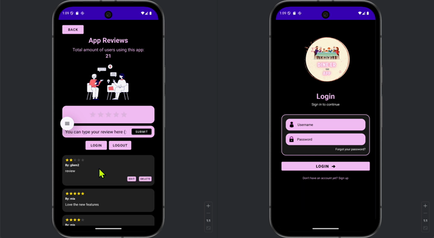
  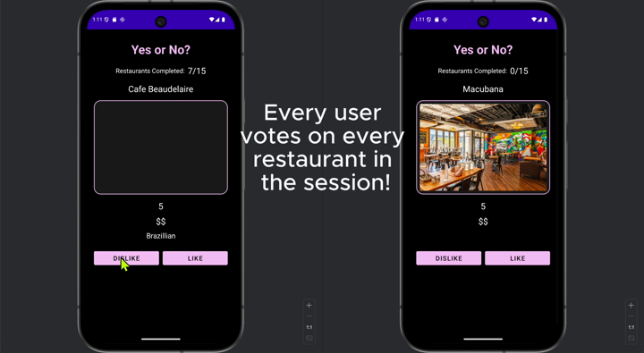
</p>

---

# 👩‍💻 My Contributions

My primary role was **Front-End Developer**, with work spanning UI implementation, networking integration, real-time features, testing, and CI/CD.

The archived Git history contains **117 unique commits** attributed to my Iowa State email/name variants.

## 🍽️ Restaurants & Admin Management

I worked on the restaurant experience for both regular users and administrators.

The Android implementation uses:

`RecyclerView` • `Volley` • `JSON` • `REST APIs`

Key behavior includes:

- Loading restaurant data from the backend
- Displaying restaurant cards
- User-facing restaurant browsing
- Administrator-only create controls
- Editing existing restaurant information
- Deleting restaurant records
- Role-based UI behavior

<p align="center">
  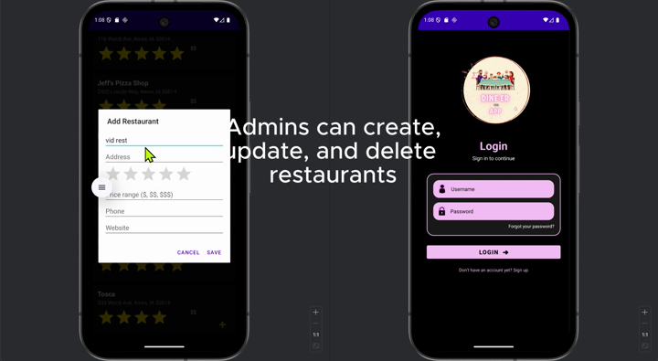
</p>

---

## ⭐ App Reviews & WebSockets

I worked on the App Reviews experience and experimented with / integrated WebSocket-based real-time behavior.

The feature allows users to:

- View app reviews
- Submit ratings and written feedback
- Edit or delete review content
- See review information update within the app

The broader project design also included live review notifications for administrators.

<p align="center">
  
</p>

---

## 👤 Signup, Navigation & Account Flows

My project history also includes work on:

- Initial Android frontend setup
- Sign-up flow
- Main/application overview screens
- Navigation
- Account-related UI
- User-facing screens connected to backend APIs

---

## 🔌 Frontend Networking

The Android frontend communicates with the backend through:

- **Volley HTTP requests** for REST operations
- **WebSockets** for live session/review/voting behavior
- JSON request and response handling
- Shared networking helpers

---

## 🧪 Testing

I wrote and documented Android UI/system tests for the feature set I worked on.

My submitted testing report states that:

- **22 of 26** methods in my focused method set were directly exercised by at least one test — approximately **85%**
- Global JaCoCo project instruction coverage was **61%**
- Global JaCoCo project branch coverage was approximately **60%**

The global percentages cover the entire team codebase; the 22/26 figure is specifically tied to the focused set of methods documented in my report.

Test areas included:

`Login` • `Sign Up` • `Main Navigation` • `Restaurants` • `User History` • `Reviews` • `Volley` • `WebSockets` • `Auth Helpers`

See [`docs/TESTING.md`](docs/TESTING.md).

---

## ⚙️ CI/CD

I also worked on the project's frontend CI/CD configuration and pipeline troubleshooting.

The project history includes repeated CI/CD iterations for:

- Frontend Gradle configuration
- Pipeline testing
- Gradle wrapper/path fixes
- Frontend-specific pipeline updates

---

# 🔄 How Dine-Der Works

```text
Create / Log In
      │
      ▼
Choose Role / Open App
      │
      ▼
Host Creates Session ────── User Enters Join Code
      │                            │
      └────────────┬───────────────┘
                   ▼
               Ready Up
                   │
                   ▼
          Swipe Restaurants
                   │
                   ▼
             Top Results
                   │
          ┌────────┴────────┐
          │                 │
       No Tie             Tie
          │                 │
          │             Final Vote
          │                 │
          └────────┬────────┘
                   ▼
          Final Restaurant
```

---

# ⚡ Real-Time Features

The project uses WebSockets for several interactive flows.

### Session / Lobby
Participants can join a session and see readiness state update as the group prepares to start.

### App Reviews
Review-related activity can update in real time.

### Voting
Voting infrastructure supports live group decision behavior.

The screen-flow and role design documented separate User, Host, and Administrator capabilities.

---

# 👥 Roles

## User

Users can:

- Join a dining session
- Swipe restaurant options
- Participate in voting
- View and submit app reviews
- Manage their account
- View participant readiness

## Host

Hosts can additionally:

- Create a session
- Configure session preferences
- Start a session
- Manage waiting-room progression
- Resolve or control final decision behavior depending on session settings

## Administrator

Administrators can additionally:

- Manage restaurant records
- Add, edit, and remove restaurants
- Access administrative information and app feedback

---

# 🧱 Architecture

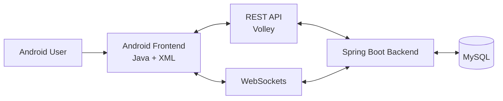

The backend is organized around standard layers:

```text
Controllers
    ↓
Services
    ↓
Repositories
    ↓
Entities / Database
```

The project also uses DTOs for API and voting/session responses.

See [`docs/ARCHITECTURE.md`](docs/ARCHITECTURE.md).

---

# 🗃️ Main Data Model

The team design included entities for:

- Users
- Restaurants
- Cuisines
- Images / Photos
- Sessions
- Session Participants
- Votes
- Session Preferences
- Session Results
- App Reviews

This supports both individual account features and multi-user dining sessions.

---

# 🎨 From Design to Working App

The original screen-design document mapped the application's user roles, database concepts, screen flow, and individual UI responsibilities.

## Screen Flow

<p align="center">
  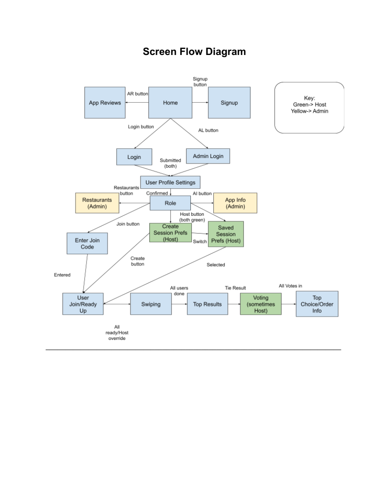
</p>

## My App Reviews Design

<p align="center">
  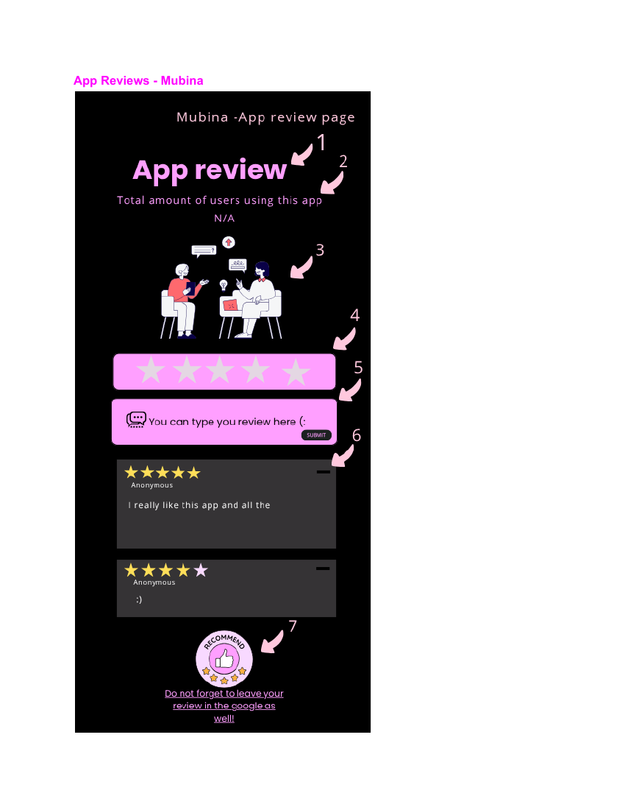
</p>

## My Restaurants Design

<p align="center">
  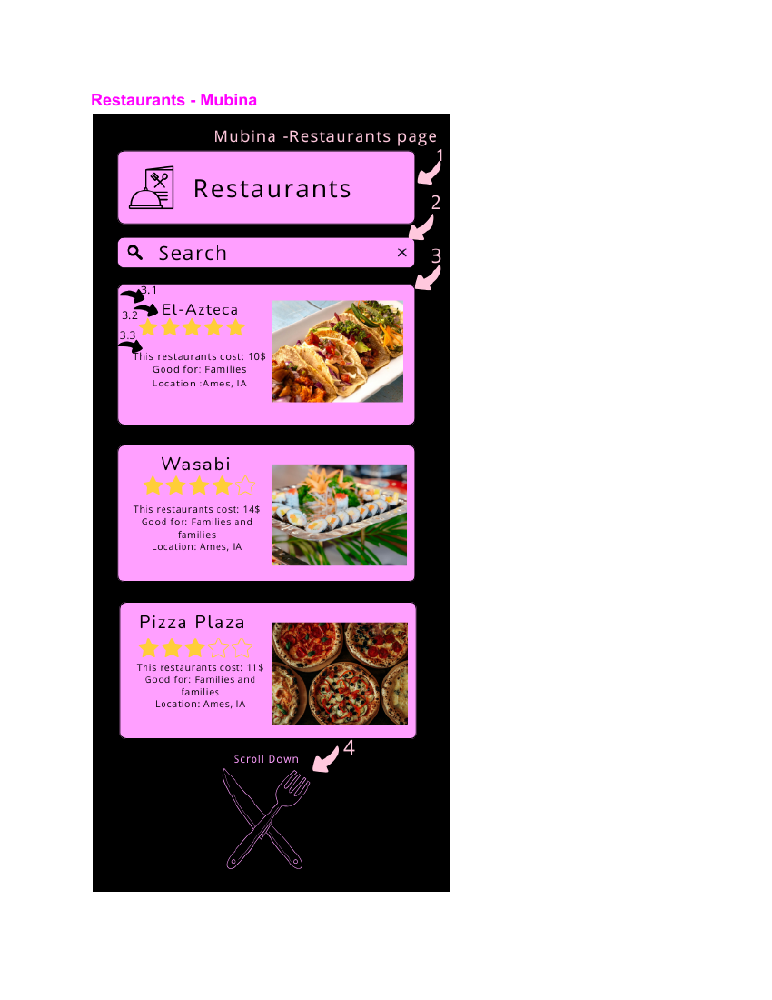
</p>

## Admin Restaurant Design

<p align="center">
  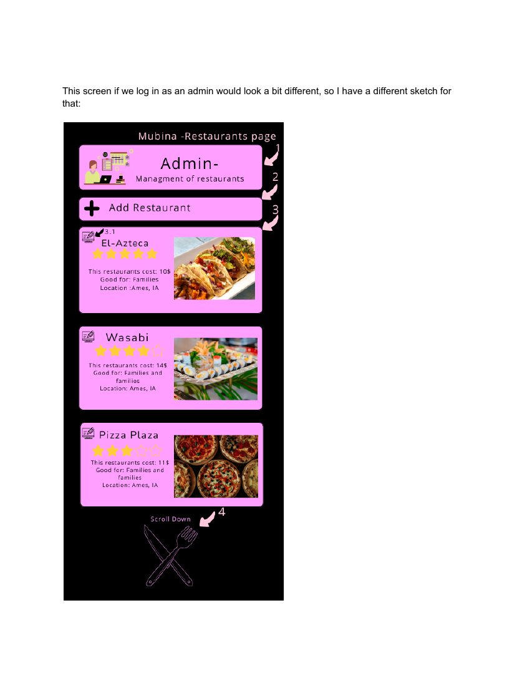
</p>

The project then evolved into the working Android implementation shown in the demo.

---

# 📱 Demo Highlights

<p align="center">
  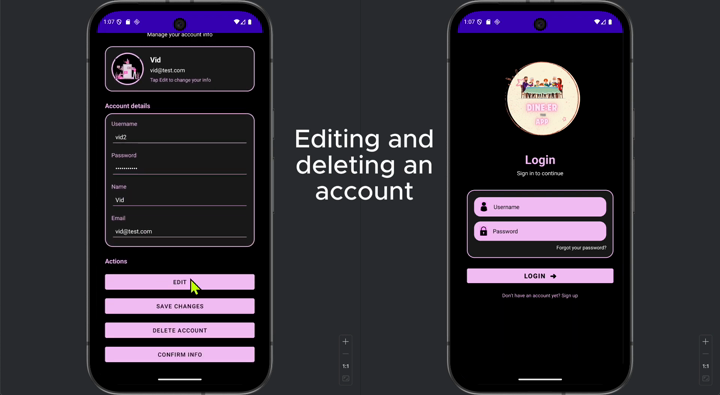
  
</p>

<p align="center">
  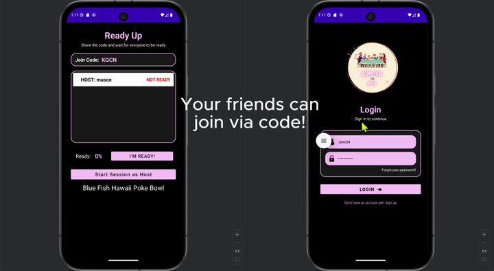
  
</p>

<p align="center">
  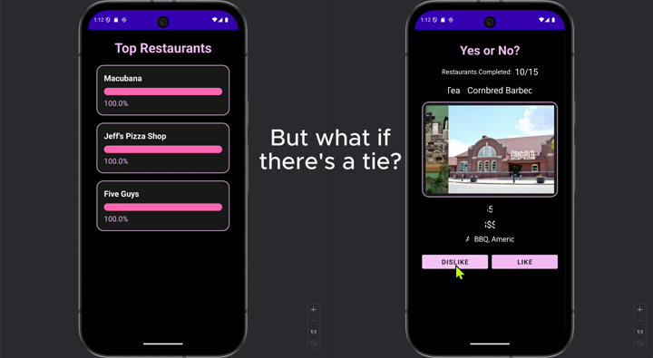
</p>

---

# 🛠️ Technology Stack

## Android Frontend


## Backend


## Engineering


---

# 📁 Repository Structure

```text
dineder/
│
├── README.md
│
├── frontend/
│   ├── app/
│   │   └── src/
│   ├── gradle/
│   └── build.gradle
│
├── backend/
│   ├── src/
│   └── pom.xml
│
├── assets/
│   ├── demo/
│   └── design/
│
├── demo/
│   └── dineder-demo.mp4
│
├── docs/
│   ├── ARCHITECTURE.md
│   ├── ATTRIBUTION.md
│   ├── SECURITY_NOTES.md
│   └── TESTING.md
│
└── .gitignore
```

This is a curated portfolio copy rather than a raw export of the original class repository.

---

# 🚀 Running the Project Locally

## Backend

Requirements:

- Java 17
- Maven
- MySQL

Configure environment variables:

```bash
export DB_URL="jdbc:mysql://localhost:3306/dineder?useSSL=false"
export DB_USERNAME="root"
export DB_PASSWORD="your_password"
```

Then run:

```bash
cd backend
mvn spring-boot:run
```

The backend defaults to:

```text
http://localhost:8080
```

---

## Android Frontend

Open the `frontend/` folder in Android Studio.

The public portfolio copy replaces the original class server address with:

```text
http://10.0.2.2:8080
```

which allows an Android emulator to connect to a backend running on the development computer.

Run the app through Android Studio after the backend is available.

---

# 🔐 Security Note

This was an academic prototype, not a production authentication system.

Before preparing this public portfolio copy, private infrastructure credentials from the original class project were removed and database configuration was converted to environment variables.

The original prototype also uses simplified authentication patterns that should be redesigned before any production deployment.

See [`docs/SECURITY_NOTES.md`](docs/SECURITY_NOTES.md).

---

# 👥 Team Project & Attribution

Dine-Der was completed by a **four-person COM S 3090 team**.

The repository includes team-developed frontend and backend code so the complete system can be understood.

My main areas of contribution were:

```text
Android Frontend
      +
Restaurants / Admin UI
      +
App Reviews / WebSockets
      +
Signup & Navigation
      +
Testing
      +
Frontend CI/CD
      +
Documentation
```

See [`docs/ATTRIBUTION.md`](docs/ATTRIBUTION.md) for additional context.

---

# 💡 What I Learned

This project strengthened my experience with:

- Building a multi-screen Android application
- Connecting Android UI to REST APIs
- Working with real-time WebSocket communication
- Designing role-based interfaces
- Testing UI and system flows with Espresso
- Tracking code coverage
- Debugging frontend/backend integration
- Working within a four-person software team
- Using Git branches and CI/CD workflows
- Turning screen sketches and requirements into a working application

---

# 🔗 Connect With Me

<p align="center">

<a href="https://github.com/mubina-s">
  
</a>

<a href="https://www.linkedin.com/in/mubina-sadriddinova-bb889a363/">
  
</a>

<a href="mailto:mubish@iastate.edu">
  
</a>

</p>

---

<p align="center">
  <i>Turning "Where should we eat?" into a real-time group decision.</i>
</p>
